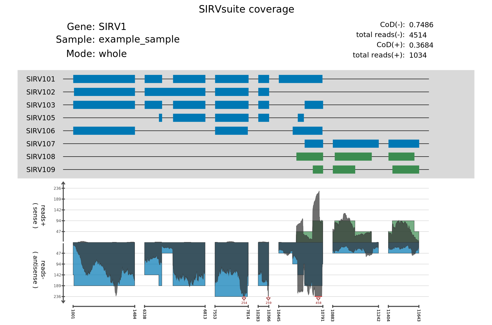

SIRVsuite is a command line tool to analyze performance of SIRV set 3 and 4 spike-ins based on alignment and transcript count data.

SIRVsuite is permitted under the following licence xxx.

**General usage**
```
python SIRVsuite.py [-h] -i SAMPLE_SHEET -o OUTPUT_DIR [-a|--all-modules] [--coverage|--ERCC-correlation|--SIRV-concentration] [--experiment-name EXPERIMENT_NAME]
```

## Getting started
## 1. Installation
To install SIRVsuite, an environment for all depedent packages needs to be created. Thus, install/sirvsuite_env.yml can be used via conda command
```
conda env create -p PATH_TO_CONDA -f install/sirvsuite_env.yml
```

to create a virtual conda environment, from which SIRVsuite.py can run.

Another option is to install python packages directly, which is not recommended due to possible dependency conflicts.

## 2. Preparing sample sheet
The SIRVsuite consists of the following modules: coverage, SIRV concentration and ERCC correlation. The modules have different requirements in terms of input files and necessary parameters for ther processing. Therefore, a .csv file comprised of such information needs to be created. We call this type of file a sample sheet. An example of a valid sample sheet:

```
sample_name;alignment_path;counting_path;read_orientation;counting_method;counting_feature;library_prep_type;replication_group
sample_name_1;/home/user/alignment_data/sample_name_1.bam;/home/user/transcipt_count_data/sample_name_1.tsv;FWD;mix2;transcript;whole
sample_name_2;/home/user/alignment_data/sample_name_2.bam;/home/user/transcipt_count_data/sample_name_2.tsv;FWD;mix2;transcript;whole
```

The SIRVsuite tool will automatically check whether specified module can be invoked based on the sample sheet specification.

### Sample sheet content description

Sample sheet is required to have a following format:
- used ";" separator
- trailing whitespace or tab is allowed (trimmed during reading process)
- UTF-8 encoding
- every column must have a name which is predefined (see more info below)
- column values are case insensitive
- the order of columns can be arbitrary

**Allowed columns**:

Columns in the sample sheet can be divided into different categories. General columns are always required, the other columns relate to the module of interest.

General columns:
1. sample_name: any set of characters to identify samples (this will be printed in the final graphics).

2. library_prep_type: whole (whole transcriptome library prep) or qs (QuantSeq library preparation)

SIRV-concentration & ERCC-correlation:

3. counting_path: valid path to count files.
4. counting_method: mix2, cufflinks or htseq. Defines, how the count file should be read.
5. counting_feature: gene or transcript. Defines, whether ERCC correlation plots and tables are quantified (gene counts) or ERCC correlation + SIRV heatmap and boxplot are quantified (transcript counts).
6. replicate_group(optional): replicate groups definition, the same value assigned to multiple samples, their mean value will be used for quantification and will be used instead of sample names if the final graphics visualization. If replicate group is to be defined for a subset of samples, use "none" value to treat samples separately and use sample_names in the graphics instead.

Coverage:

7. alignment_path: valid path to a .bam file.
8. read_orientation: fwd, rev or none. Use "fwd" or "rev" for strand-specific libraries, "none" for non-strand specific libraries.

Any other column will be ignored.

## 3. Running SIRVsuite

SIRVsuite accepts the following arguments:

    required arguments:
      -i, --sample-sheet       path to the sample sheet
      -o, --output-dir         directory for output files

    selectively required arguments* (at least one is required):
      -a, --all-modules        triggers all available modules
      --ERCC-correlation        triggers processing of ERCCs ratios
      --SIRV-concentration      triggers processing of SIRVs relative concentration
      --coverage                triggers coverage processing

      * Note that using "-a" is the same as "--ERCC-correlation --SIRV-concentration --coverage".
       A valid usage is to specify at least one of the modules or to use -a argument.

    optional arguments:
      --experiment-name         name of the experiment to displayed in the final graphics (if empty, general title will be used)
      -h, --help                show help message and exit

Example commands:
```
  # run SIRVsuite to generate coverage plots, data, relative abundance with heatmap and boxplot from sample information in sample_sheet.csv
  python SIRVsuite.py -i sample_sheet.csv -o /home/user/SIRVsuite_output/ --experiment-name "sequencing-run-1" --coverage --SIRV-concentration

  # run SIRVsuite to perform whole analysis from sample information in sample_sheet.csv
  python SIRVsuite.py -i sample_sheet.csv -o /home/user/SIRVsuite_output/ --experiment-name "sequencing-run-1" -a
```

## 4. Output data
The pipeline will create subfolder for every specified module with module-specific output data.

**Coverage module**

The module processes .bam files + SIRV-set 3-4 annotation, calculates coverage (expected + measured) and creates 3 types of output:

- CoD table,
- coverage data in bigwig format,
- coverage plot.

The CoD metrics allows to measure the resemblence between expected (theoretical) and measured (real) coverage. The theoretical coverage is calculated based on annotated distribution of exons, whilst the measured coverage is quantified from the reads obtained from the sequencer. For CoD applies: CoD >= 0, where values around 0 indicate an ideal match between expected and measured coverage.

Measured coverage in bigwig (.bw) format can be used, for example, in a IGV browser to inspect spike-in coverage interactively. See more info about bigwig: http://genome.ucsc.edu/goldenPath/help/bigWig.html.

Coverage plot can serve as an overview of exon distribution for different transcript variants, the corresponding expected coverage based on annotation and the measured read distribution fits into these regions. In addition, it provides a basic statistics along with a CoD value.

Example of a coverage plot:



**ERCC-Correlation module**

The module processes transcript or gene counts and input concentration of ERCCs. It creates two types of output:

- correlation table,
- correlation plot.

The correlation table consist of R^2 values for each sample, the correlation plot displays an overview of distribution of ERCC gene concentration ratios.

**SIRV-concentration module**

The module processes transcript FPKM values for SIRVs and creates 3 types of output:

- boxplot,
- relative concentration table,
- heatmap.
